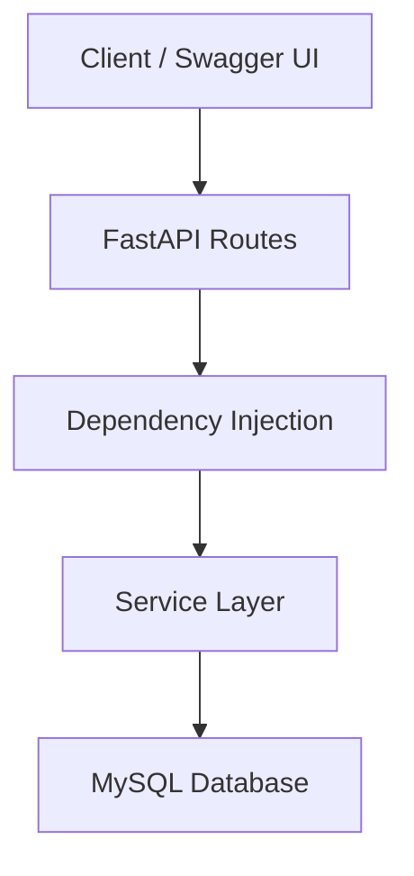
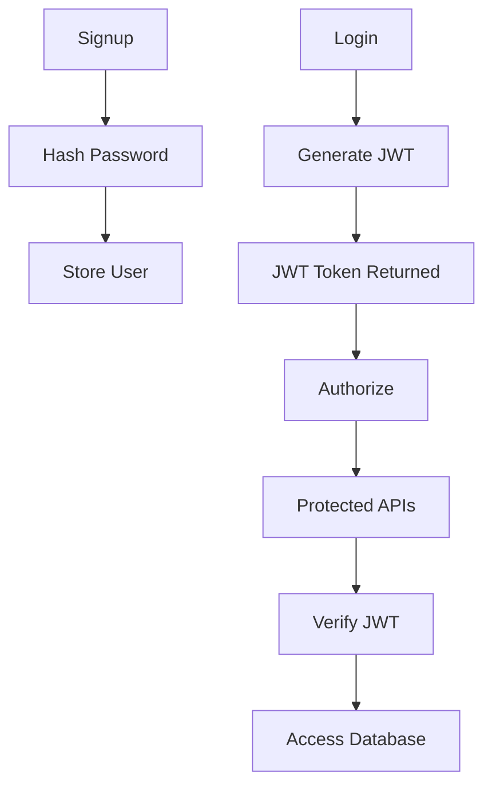
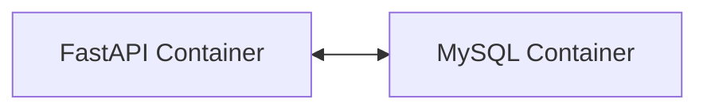

# 🚀 Lead Management Backend (FastAPI + MySQL)

A production-style **Lead Management REST API** built using **FastAPI**, **MySQL**, **JWT Authentication**, **Docker**, and **AWS EC2**.

The project demonstrates modern backend development practices including authentication, authorization, dependency injection, service-layer architecture, Docker containerization, and cloud deployment.

---

# ✨ Features

### 🔐 Authentication & Authorization

✅ User Signup

✅ User Login

✅ Password Hashing (bcrypt)

✅ JWT Authentication

✅ Protected Routes

✅ User-specific Lead Ownership

✅ Authorization (Users can access only their own leads)

---

### 📋 Lead Management

✅ Create Lead

✅ Get All Leads

✅ Get Lead by ID

✅ Update Lead

✅ Delete Lead

✅ Dynamic Lead Filtering

---

### 🏗 Backend Architecture

✅ Service Layer Architecture

✅ Dependency Injection

✅ Pydantic Validation

✅ Environment Variables

✅ Dockerized Application

✅ AWS EC2 Deployment

---

# 🛠 Tech Stack

| Technology | Purpose |
|------------|----------|
| Python | Backend Language |
| FastAPI | REST API Framework |
| MySQL | Database |
| Docker | Containerization |
| Docker Compose | Multi-container Management |
| JWT | Authentication |
| OAuth2 | Authorization |
| Passlib (bcrypt) | Password Hashing |
| Pydantic | Request Validation |
| Swagger UI | API Documentation |
| AWS EC2 | Cloud Deployment |
| Git & GitHub | Version Control |

---

# 🏛 Project Architecture



---

# 🔑 Authentication Flow



---

# 🐳 Docker Architecture



---

# 📂 Project Structure

```text
lead-management-backend/

├── routes/
│   ├── auth.py
│   └── leads.py
│
├── services/
│   ├── auth_service.py
│   └── lead_service.py
│
├── schemas.py
├── db.py
├── main.py
├── Dockerfile
├── docker-compose.yml
├── requirements.txt
├── README.md
└── .env.example
```

---

# 🚀 Running the Project

## 1️⃣ Clone Repository

```bash
git clone https://github.com/kratitechie/lead-management-backend.git

cd lead-management-backend
```

---

## 2️⃣ Create Environment Variables

Create a `.env` file inside the project root.

```env
DB_HOST=mysql
DB_PORT=3306
DB_NAME=fast_api_project
DB_USER=root
DB_PASSWORD=your_password

SECRET_KEY=your_secret_key
ALGORITHM=HS256
ACCESS_TOKEN_EXPIRE_MINUTES=30
```

---

## 3️⃣ Build & Start Containers

```bash
docker compose up --build
```

---

## 4️⃣ Open Swagger Documentation

```
http://localhost:8000/docs
```

---

# 📡 API Endpoints

## Authentication

| Method | Endpoint | Description |
|---------|----------|-------------|
| POST | /signup | Register User |
| POST | /login | Login User |

---

## Leads

| Method | Endpoint | Description |
|---------|----------|-------------|
| POST | /lead | Create Lead |
| GET | /leads | Get All User Leads |
| GET | /leads/{id} | Get Lead by ID |
| PATCH | /leads/{id} | Update Lead |
| DELETE | /leads/{id} | Delete Lead |

---

# 📸 API Screenshots

### Swagger Home

> D:\Coding\Projects\fastapi\Images\Swagger_home.png
---

### User Login

> D:\Coding\Projects\fastapi\Images\Login.png

---

### Docker Compose

> D:\Coding\Projects\fastapi\Images\Docker.png

---

### AWS Instance

> D:\Coding\Projects\fastapi\Images\AWS_instance.png

### AWS Instance

> D:\Coding\Projects\fastapi\Images\JWT authentication.png

---

# 💡 Skills Demonstrated

- REST API Design
- CRUD Operations
- JWT Authentication
- OAuth2
- Password Hashing
- Service Layer Architecture
- Dependency Injection
- Docker
- Docker Compose
- AWS EC2 Deployment
- MySQL Integration
- Dynamic SQL Queries
- Environment Variable Management
- API Documentation
- Git Workflow

---

## 🚀 Live Demo

**Swagger UI**

http://16.171.150.6:8000/docs

> Note: The EC2 instance may be stopped when not in use to reduce AWS costs.

# 🚀 Future Improvements

- Duplicate Phone Number Detection
- Multiple Contact Numbers per Lead
- Pagination
- Search & Sorting
- Role-Based Access Control (RBAC)
- Refresh Tokens
- Audit Logs
- Unit Testing
- CI/CD using GitHub Actions
- React Frontend Dashboard
- Follow-up Reminder System

---

# 📚 What I Learned

Through this project I gained practical experience with:

- Building RESTful APIs using FastAPI
- Designing scalable Service Layer Architecture
- JWT Authentication & Authorization
- MySQL Database Integration
- Docker & Docker Compose
- Deploying applications on AWS EC2
- Managing configuration using Environment Variables
- Writing clean, modular backend code
- Documenting APIs using Swagger UI

---

# 👩‍💻 Author

**Krati Bhatia**

Backend Developer | Python | FastAPI | AWS | Docker

⭐ If you found this project helpful, consider giving it a star.